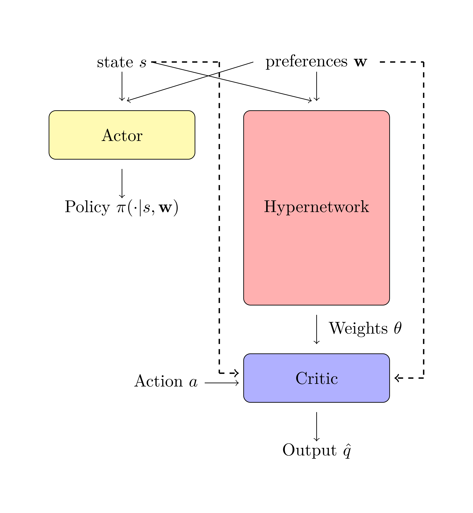
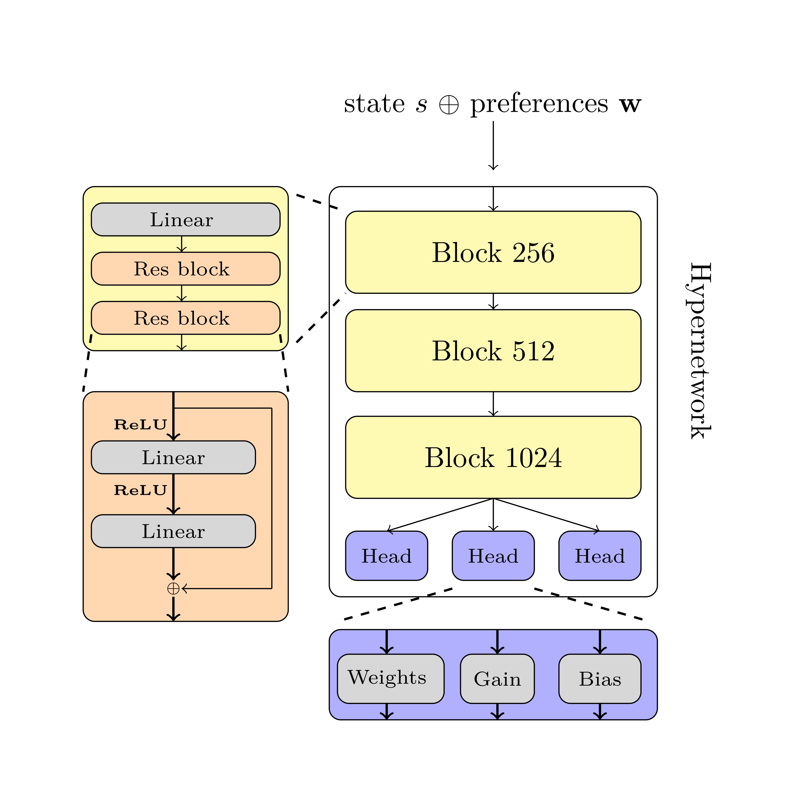
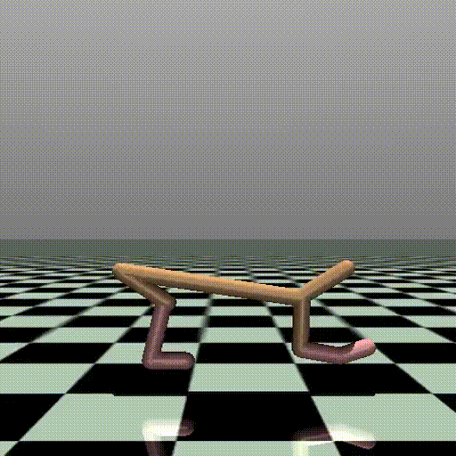
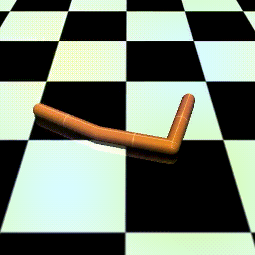
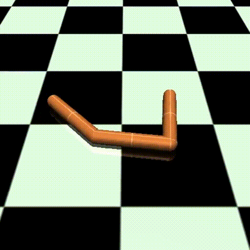
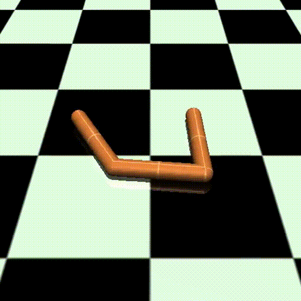
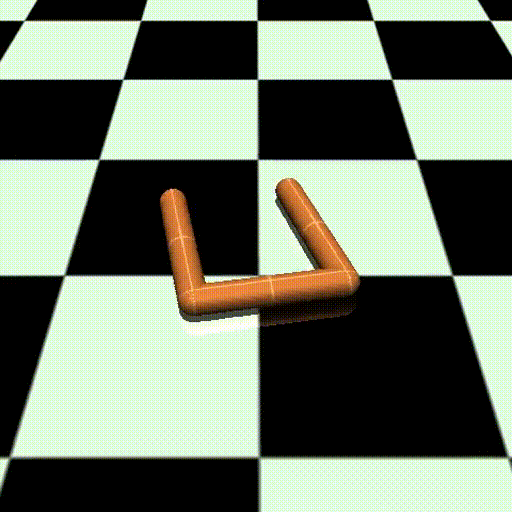

<div align="center">
  <h2 align="center"> Hypernetwork augmented multi-objective Actor-Critic </h2>
  <p align="center">
    Implementation for the MSc thesis "Generalizing Pareto optimal policies in multi-objective reinforcement learning"
    </br>
    <a href="https://santerihei.github.io/hypernet_morl_presentation/"><strong> Presentation slides</strong></a> | <a href="https://urn.fi/URN:NBN:fi:tuni-202409058563"> <strong> Thesis</strong> </a>
  </p>
</div>


## About
In this thesis, the use of hypernetworks in multi-objective reinforcement learning is explored by
augmenting the critic network with a hypernetwork. Two different input configurations for the target network were explored 
to find out the expressiveness of the predicted parameters.
<p float="left">
  
  
</p>


### Examples of the learned policies
#### Halfcheetah
Objectives: Energy efficiency and forward speed.
<p float="left">
  
  
  
  
  
</p>

#### Hopper
Objectives: Jump height and forward speed.
<p float="left">
  
  
  
  
  
</p>

#### Swimmer
Objectives: Energy efficiency and forward speed.
<p float="left">
  
  
  
  
  
</p>

## Getting started
Start by cloning the repository:
```bash
git clone git@github.com:SanteriHei/hypernet_morl.git && cd hypernet_morl
```
This project uses [Pipenv](https://pipenv.pypa.io/en/latest/) for dependency management, which can be
installed by running
```bash
pip install --user pipenv
```
Then, create a new virtual environment and install the required dependencies via
```bash
pipenv install --dev
```

> [!NOTE]
> the `--dev` flag includes some dependencies that are not always neccessary, so it can be omitted.

Lastly, activate the pipenv shell with `pipenv shell`

The project also uses [Hydra](https://hydra.cc/docs/intro/) for configuration management and 
[Wandb](https://docs.wandb.ai/) logging the run information. Thus, it is recommended that one creates
an (free) account to wandb before running any experiments. After this, remember to update the following 
configuration options either via cli (recommended) or by updating configs/session.yaml:

 - session_cfg.entity_name
 - session_cfg.project_name
 - session_cfg.experiment_group
 - session_cfg.run_name

> [!CAUTION]
> The wandb logging can be turned off by adding via cli option `training_cfg.log_to_wandb=False`.
> However, this is highly __discouraged__, since in this case the progress is only
> printed to the console, and __NOT__ stored anywhere.


### Example configurations
Here are a few examples for running certain experiments presented in the thesis

<details>
<summary>Halfcheetah with no warmup and ResNet Hypernetwork</summary>

```bash
python main.py device="cuda:0" seed=0 training_cfg=halfcheetah\
  training_cfg.n_warmup_steps=0\
  training_cfg.save_individual_losses=False\
  training_cfg.save_path="path/to/my-run"\
  session_cfg.entity_name="my-entity"\
  session_cfg.project_name="my-project"\
  session_cfg.run_name="my-run"\
  session_cfg.experiment_group="my-group"
```
</details>

<details>
<summary> Halfcheetah with no warmup and MLP hypernetwork</summary>

```bash
python main.py device="cuda:0" seed=0 training_cfg=halfcheetah\
  critic_cfg=mlp_hypercritic\
  training_cfg.n_warmup_steps=0\
  training_cfg.save_individual_losses=False\
  training_cfg.save_path="path/to/my-run"\
  session_cfg.entity_name="my-entity"\
  session_cfg.project_name="my-project"\
  session_cfg.run_name="my-run"\
  session_cfg.experiment_group="my-group"
```
</details>


<details>
<summary> Halfcheetah with skewed warmup distribution and ResNet hypernetwork</summary>

```bash
python main.py device="cuda:0" seed=0 training_cfg=halfcheetah\
  training_cfg.n_warmup_steps=2.4e5\
  training_cfg.warmup_use_uneven_sampling=True\
  training_cfg.save_individual_losses=False\
  training_cfg.save_path="path/to/my-run"\
  session_cfg.entity_name="my-entity"\
  session_cfg.project_name="my-project"\
  session_cfg.run_name="my-run"\
  session_cfg.experiment_group="my-group"
```
</details>

<details>
<summary>Hopper with no warmup and ResNet Hypernetwork</summary>

```bash
python main.py device="cuda:0" seed=0 training_cfg=hopper\
  training_cfg.n_warmup_steps=0\
  training_cfg.save_individual_losses=False\
  training_cfg.save_path="path/to/my-run"\
  session_cfg.entity_name="my-entity"\
  session_cfg.project_name="my-project"\
  session_cfg.run_name="my-run"\
  session_cfg.experiment_group="my-group"
```
</details>

<details>
<summary>Swimmer with no warmup and ResNet Hypernetwork</summary>

```bash
python main.py device="cuda:0" seed=0 training_cfg=swimmer\
  training_cfg.n_warmup_steps=0\
  training_cfg.save_individual_losses=False\
  training_cfg.save_path="path/to/my-run"\
  session_cfg.entity_name="my-entity"\
  session_cfg.project_name="my-project"\
  session_cfg.run_name="my-run"\
  session_cfg.experiment_group="my-group"
```
</details>

## Acknowledgements

This work heavily utilizes the previous research of
<a href="https://proceedings.mlr.press/v139/sarafian21a.html">Sarafian et al.</a> and
<a href="https://openreview.net/forum?id=TjEzIsyEsQ6">Lu et al.</a> for application
of the hypernetworks in reinforcement learning context and 
for the CAPQL algorithm used for training the MORL agents respectively. 

The proposed methods were evaluated in three robot controls tasks designed by <a href="https://people.csail.mit.edu/jiex/papers/PGMORL/">Xu et al.</a> [^1]. Moreover, the original
implementation by <a href="https://github.com/mit-gfx/PGMORL">Xu et al.</a> was used for PGMORL, while the implementations from <a href="https://github.com/LucasAlegre/morl-baselines/tree/main">morl-baselines</a> by <a href="https://openreview.net/pdf?id=jfwRLudQyj">Felten et al.</a> were used for CAPQL and GPI-LS.

[^1]: The tasks were ported to the v4 implementations of the environments.


